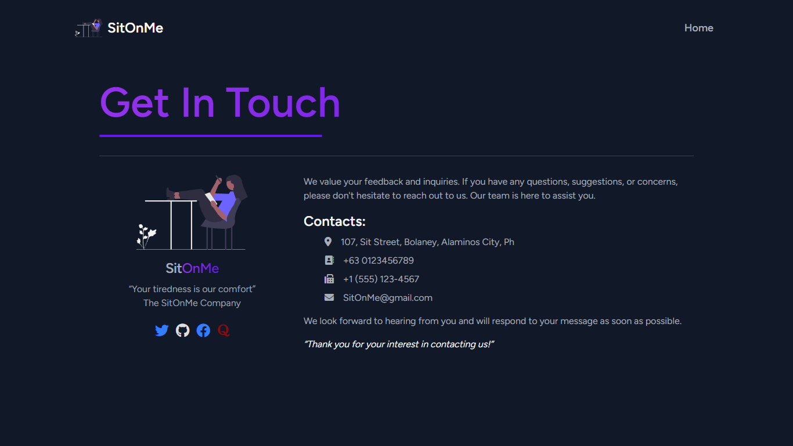

# SitOnMe 🪑

## About SitOnMe
SitOnMe is a web application created for an imaginary furniture e-commerce company, primarily focusing on chairs. It incorporates all vital elements of a full-stack e-commerce platform, delivering a user-friendly and feature-rich online shopping experience.

## Pages Preview
> Explore a glimpse of the web app with some of the selected pages.
### Homepage


### Shop

### Product

### User Cart

### User Orders

### Admin Side


### Contact


## Setup

-   Create a .env file in the root directory
-   Refer to .env.example for your .env file
-   Adjust .env variable values to your needs (e.g. db connections)
-   Run these commands

```bash
php artisan key:generate
php artisan config:cache
```

### Laravel Commands

```bash
php artisan migrate --path=database/migrations/2023_04_07_085718_create_payment_methods_table.php
php artisan migrate
php artisan db:seed
php artisan serve
```

### Node Commands:

```bash
npm install
npm run dev
```

## User's Account Sample

Use the following credentials to access a sample user account:

-   Name: Lorem Ipsum
-   Address: Bolaney, Alaminos City, Pangasinan
-   Email: lorem@gmail.com
-   Password: 123123123

## Super/Head Admin's Account

Use the following credentials to access the super/head admin account:

-   Name: Head Admin
-   Address: Bolaney, Alaminos City, Pangasinan
-   Email: SitOnMe@gmail
-   Password: 123123123

See the screenshots folder for the project preview and also feel free to fork the code and tailor it to your preferences. 🐱‍👤
